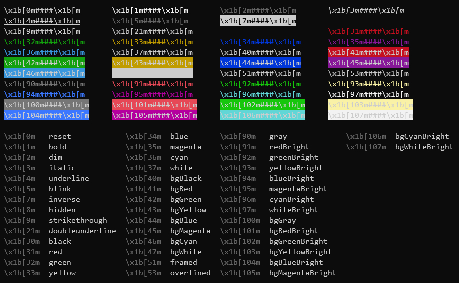

# node-scripts

Some useful scripts in Node.js

## [migrate-checkupdate-package-info](migrate-checkupdate-package-info.js)

When migrating, check update the dependencies in `package.json`. Example:

```shell
$ cd /path/to/your-project
$ node migrate-checkupdate-package-info.js
- 'electron' 17.4.7 -> 21.3.1 BREAKING CHANGES!
   Useful infomations:
    - Homepage: https://github.com/electron/electron#readme
    - Repository: { type: 'git', url: 'git+https://github.com/electron/electron.git' }        
    - See: https://github.com/electron/electron/releases/tag/v21.0.0

- 'front-matter' 
- '@primer/primitives' 7.5.0 -> 7.10.0
✗ 'js-yaml' 
- 'marked' 4.0.12 -> 4.2.3
```

## [tools-net-tcping](tools-net-tcping.js)

Check TCP connections. See also [tcping](https://www.elifulkerson.com/projects/tcping.php). Example:

```shell
$ node tools-net-tcping.js www.example.org
$ node tools-net-tcping.js -n 4 example.org 443
PING www.example.org:443 (0.0.0.0) TCP connections:
Connected 0.0.0.0:443/tcp: time=150ms
Timeout.
Network error.
Connected 0.0.0.0:443/tcp: time=167ms

Ping statistics for [www.example.org:443]:
   4 connections, 15% failures, avg=157ms, max=167ms, min=150ms.
```

### Arguments

|Arg|Description|Default||
|-|-|-|-|
|`-n`|Count of connections|**`4`**|-|
|Hostname|-|-|Required|
|Port|-|**`80`**|-|

## [nodejs-watch-runner](nodejs-watch-runner.js)

Auto re-execute the script when itself or its' required modules changed, only work with CommonJS module. Example:

```shell
$ node nodejs-watch-runner.js tools-net-tcping.js -n 2 example.org
[] 2022-12-09T09:07:05.082Z
PING example.org:80 (110.242.68.66) TCP connections:
Connected 110.242.68.66:80/tcp: time=43ms
Connected 110.242.68.66:80/tcp: time=38ms

Ping statistics for [example.org:80]:
   2 connections, 0% failures, avg=41ms, max=43ms, min=38ms.
[] 2022-12-09T09:07:17.382Z
restart
PING ...
```

## [nodejs-tty-colors](nodejs-tty-colors.js)

Print color styles, use built-in [`util.inspect.colors`](https://nodejs.org/api/util.html#modifiers). See also at <https://stackoverflow.com/a/28938235>.


